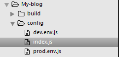
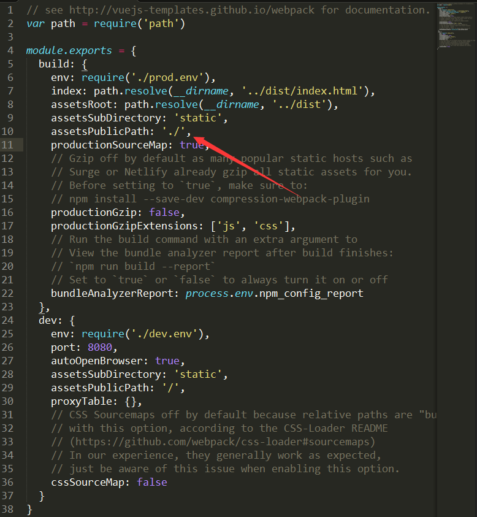

# 关于一些环境搭建及配置问题

> vue-cli使用

1. 安装node.js

[https://nodejs.org/en/download/](https://nodejs.org/en/download/)

2. 安装vue-cli
``` bash
$ npm install -g vue-cli
```

3. 使用vue-cli初始化项目
``` bash
$ vue init webpack fileName
```


4. 之后的操作请参照项目中 ```README.md``` 文件里的步骤即可

> vue-cli构建的项目中引入scss等文件

1. 安装 __node-sass__ 及 __sass-loder__(安装需要python2.7环境 [https://www.python.org/downloads/](https://www.python.org/downloads/)  安装后还需设置环境变量，请度娘，重启)
``` bash
$ npm install node-sass --save-dev

$ npm install sass-loder --save-dev
```

2. 找到 __build__ 目录下 __webpack.base.conf.js__ 文件 修改配置，如图：


__module__ 的 __rules__ 中添加


即可在 __.vue__ 文件中使用 __scss__ 语法或引入 __.scss__ 文件


> vue-cli构建的项目中引入md文件

1. 安装 __vue-markdown-loader__
``` bash
$ npm install vue-markdown-loader --save-dev
```

2. 找到 __build__ 目录下 __webpack.base.conf.js__ 文件中 __module__ 的 __rules__ 中添加配置，如图：


即可在 __.vue__ 文件中使用 引入 __.md__ 文件作为组件


> npm run build后本地无法访问以及图片丢失问题

1. 找到 __config__ 目录下 __index.js__ 文件修改配置，如图：





2. 对于 __js__ 里写路径的图片丢失可以把图片都放在 __static__ 目录下，然后根据根路径对写在 __js__ 中的 __src__ 变量做出修改。